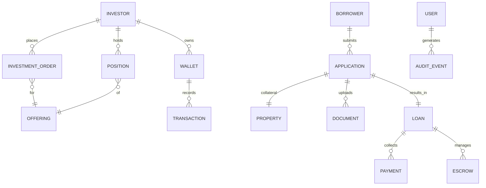
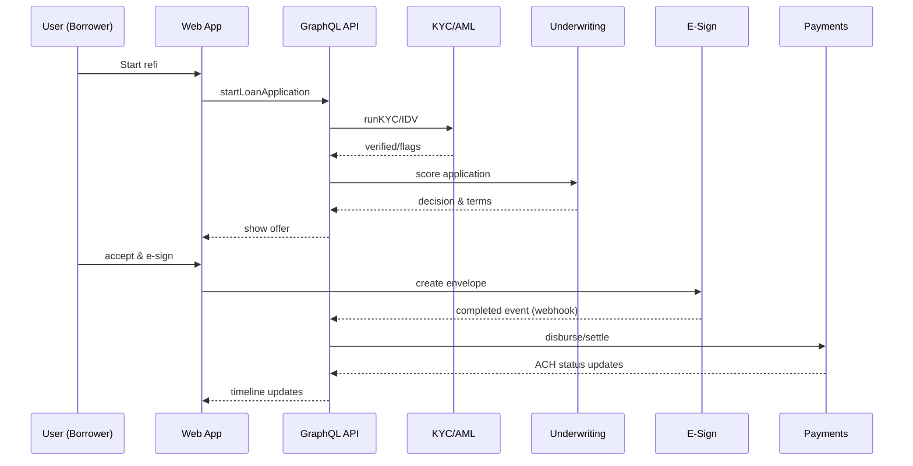

# Brickwise — Tech Stack & System Architecture

> Version: 0.1 (Sep 16, 2025) · Owner: Platform Engineering  
> Goal: Ship a secure, compliant, and scalable marketplace for **crowdsourced mortgages** and **fractional real estate**.

---

## 1) Executive Overview

Brickwise is a two‑sided platform with **Borrowers** (mortgage refinance) and **Investors** (mortgage notes, fractional properties, funds).  
The system is designed as a TypeScript‑first monorepo with a **GraphQL** API, **event-driven services**, and **strict compliance controls**.

**Primary principles**
- *Safety first*: compliance, data privacy, auditable workflows.
- *Composable*: small services glued by GraphQL and events.
- *DX forward*: TypeScript end-to-end, codegen, strict schemas.
- *Start simple, scale gracefully*: Postgres first; add services when needed.

---

## 2) High-Level Architecture

```mermaid
flowchart LR
  subgraph Client
    Web[React + Vite + Apollo]
    Admin[Admin Console]
  end

  subgraph API
    GQL[Fastify + Mercurius (GraphQL)]
    Auth[AuthN/AuthZ]
    BFF[Feature Routers]
  end

  subgraph Core Services
    Underwrite[Underwriting Service]
    KYCAML[KYC/AML Service]
    Payments[Payments & Wallets]
    Servicing[Loan Servicing]
    Property[Property Ops]
    Files[File Ingest & Storage]
    Search[Search/Index]
    Notify[Notifications]
  end

  subgraph Data
    PG[(Postgres + Drizzle ORM)]
    Redis[(Redis Cache/Queue)]
    Obj[(Object Storage / S3)]
    Logs[(OTel + Loki)]
    Metrics[(Prometheus)]
  end

  Client -->|HTTPS| GQL
  GQL -->|JWT/OIDC| Auth
  GQL --> PG
  GQL --> Redis
  GQL --> Underwrite
  GQL --> KYCAML
  GQL --> Payments
  GQL --> Servicing
  GQL --> Property
  GQL --> Files
  GQL --> Search
  Notify --> EmailSMS[Email/SMS]

  Underwrite --> PG
  KYCAML --> PG
  Payments --> PG
  Servicing --> PG
  Property --> PG
  Files --> Obj
  Search --> PG
  Logs -.-> Metrics
```

---

## 3) Product Surfaces

- **Investor Web App** (React/Vite/Apollo): browse offerings, invest, portfolio, tax docs, secondary market (later).
- **Borrower Portal**: refi application, document upload, status tracking, disclosures/e‑sign.
- **Admin Console**: KYC reviews, underwriting decisions, payouts, content, flags/audit, offers & limits management.

---

## 4) Tech Stack (opinionated)

**Frontend**
- React 18 + Vite, TypeScript
- Apollo Client (GraphQL)
- TanStack Router + Query (optional for non‑GQL calls)
- Zod for form/runtime validation, React Hook Form
- Tailwind + shadcn/ui; Framer Motion for micro‑interactions
- State: Apollo cache + lightweight Zustand where useful
- Auth: OIDC/OAuth (PKCE) via Auth provider SDK (see Security)

**Backend**
- **Bun** runtime + **Fastify** web server
- **Mercurius** for GraphQL (schema‑first, codegen)
- **Drizzle ORM** + Postgres (primary system of record)
- **Redis** for caching + BullMQ for jobs/queues
- **File processing**: pre‑signed S3 URLs, Virus scan (ClamAV)
- **Search**: Postgres FTS initially; Meilisearch later if needed
- **Background workers**: Bun workers for underwriting, KYC callbacks, webhooks, statement generation
- **Schema validation**: Zod + GraphQL input types
- **Observability**: OpenTelemetry, Prometheus, Grafana, Sentry/Highlight

**Data & Storage**
- **Postgres 16** (Cloud managed) with logical backups and PITR
- **Object Storage (S3‑compatible)** for documents (ID, W‑2s, bank statements), offering PDFs, K‑1s/1099s
- **Redis (managed)** for cache/queue, ephemeral tokens
- **Warehouse (Phase 2)**: BigQuery/Snowflake for analytics + dbt

**DevEx & CI/CD**
- Monorepo with **Bun workspaces** (or Turborepo)
- Codegen: GraphQL Code Generator → type‑safe hooks and resolvers
- ESLint + Prettier + TypeScript strict
- GitHub Actions: build/test/lint, DB migrations, container publish
- IaC: Terraform (VPC, DB, buckets, secrets, WAF, CDN)
- Preview environments per PR

**Hosting/Infra**
- Containers on Kubernetes (GKE/EKS) or Fly.io to start
- API behind API Gateway / Cloud Load Balancer + WAF
- CDN for static assets; image optimization at edge
- Secrets: Cloud Secret Manager + SOPS for local dev
- Key management: Cloud KMS (encryption at rest, envelope keys)

---

## 5) Monorepo Structure (suggested)

```
brickwise/
├─ apps/
│  ├─ web/                 # Investor/Borrower app (React/Vite)
│  └─ admin/               # Admin console (React/Vite)
├─ services/
│  ├─ api/                 # Fastify + Mercurius GraphQL gateway
│  ├─ underwriting/        # Risk scoring, decisioning workers
│  ├─ kyc-aml/             # Vendor adapters + review queues
│  ├─ payments/            # Wallets, ledger, payouts, webhooks
│  ├─ servicing/           # Amortization, statements, delinquencies
│  ├─ property/            # Property listings, rent flows, SPV mgmt
│  ├─ files/               # Uploads, scanning, OCR, e-sign stubs
│  └─ notify/              # Email/SMS/push orchestration
├─ packages/
│  ├─ config/              # tsconfig, eslint, tailwind presets
│  ├─ ui/                  # shared UI components (shadcn)
│  ├─ gql-schema/          # GraphQL schema + codegen
│  ├─ db/                  # drizzle schema, migrations, seeders
│  ├─ lib/                 # shared utils, zod schemas
│  └─ types/               # shared TS types
├─ infra/                  # terraform, helm, k8s manifests
└─ .github/workflows/      # CI/CD pipelines
```

---

## 6) Core Domains & Entities

**Borrowing (Refi)**
- Applicant, Application, Address, Employer, IncomeDoc, CreditReport, Property, Appraisal, LoanOffer, Loan, Payment, Escrow, Disclosure, ESignEnvelope

**Investing**
- Investor, KYC Profile, Wallet, BankAccount (ACH), InvestmentOrder, Offering (LoanNote | PropertySPV | Fund), Position, Distribution, TaxDoc (1099/1065/K‑1)

**Operations**
- User, Role, Permission, AuditEvent, Case, Task, Note, Flag, DocumentBlob, WebhookEvent, Notification

**Minimal ERD (sketch)**



---

## 7) API Design (GraphQL)

- Single public GraphQL endpoint with **Mercurius** (Fastify plugin).
- **Bounded modules** in the schema mirror services: `Borrowing`, `Investing`, `Kyc`, `Payments`, `Servicing`, `Property`, `Files`, `Auth`, `Admin`.
- **Query** for reads; **Mutations** for commands; **Subscriptions** for long‑running ops (doc verification, e‑sign, ACH status).

**Example (abbrev.)**
```graphql
type Query {
  offerings(filter: OfferingFilter, first: Int = 20, after: String): OfferingConnection!
  portfolio: Portfolio!
  loanApplication(id: ID!): LoanApplication
}

type Mutation {
  startLoanApplication(input: StartLoanAppInput!): LoanApplication!
  uploadDocument(input: UploadDocInit!): PresignedUpload!
  placeInvestmentOrder(input: PlaceOrderInput!): OrderResult!
  linkBankAccount(input: LinkBankInput!): BankLinkResult!
}

type Subscription {
  documentStatus(documentId: ID!): DocumentStatus!
  paymentStatus(orderId: ID!): PaymentUpdate!
}
```

**Security**
- OAuth/OIDC (PKCE) for web clients; JWT access tokens; short‑lived + refresh rota.
- Fine‑grained **AuthZ** with GraphQL directives (e.g., `@requiresRole`), plus row‑level checks in resolvers.

---

## 8) Integrations (initial vendors — pluggable)

| Domain | Purpose | Primary | Alternates |
|---|---|---|---|
| **Auth** | OIDC/AuthN/AuthZ | Auth0, Stytch | Clerk, Cognito |
| **KYC/AML** | IDV, sanctions, PEP | Persona, Alloy | Sumsub, Veriff |
| **ACH + Wallets** | Payments in/out | Unit, Moov, Stripe Treasury | Dwolla, Treasury Prime |
| **E‑Sign** | Disclosures/notes | DocuSign | HelloSign |
| **Bank Data** | Account linking | Plaid | MX, Finicity |
| **Credit Pull** | Tri‑merge/soft | Experian/Equifax | TransUnion |
| **Appraisal/AVM** | Property value | Clear Capital | HouseCanary |
| **Servicing** | Statements, escrow | Self‑serve + MSP partner | Sagent |
| **SMS/Email** | Notify | Twilio + SendGrid | Postmark, MessageBird |
| **Object Storage** | Files | S3 (or R2) | GCS, Azure Blob |
| **Analytics** | Product + BI | PostHog + dbt | Amplitude, Mixpanel |

All integrations behind **adapter interfaces** to allow vendor swaps without core changes.

---

## 9) Security, Privacy, and Compliance

- **PII + Financial**: Encrypt in transit (TLS 1.2+), at rest (KMS). Field‑level crypto for SSN, bank numbers.  
- **Secrets**: Never in code; Secret Manager + least privilege IAM.  
- **Data Minimization**: Store only what’s required for compliance/audit.  
- **Access Controls**: RBAC/ABAC, admin actions require MFA + just‑in‑time elevation.  
- **Audit**: Append‑only **AuditEvent** for every sensitive action (who/what/when).  
- **Compliance**: SOC 2 Type II (process), GLBA, state lending regs, Reg A+ (securities), KYC/AML, OFAC.  
- **Docs**: Immutable storage w/ legal retention schedules; WORM bucket policy for executed docs.  
- **Vulnerability mgmt**: Weekly SCA, monthly SAST/DAST; dependency bots; image scanning.  
- **Incident Response**: Runbooks, on‑call, postmortems; backup/restore DR drills (quarterly).

---

## 10) Observability & SLOs

- **OTel** traces/metrics/logs; RED + USE dashboards (Grafana).  
- **SLOs**: API p99 < 400ms, uptime 99.9%, doc‑upload success > 99.5%, ACH posting < T+2 (ops SLO).  
- **Alerting**: PagerDuty/FireHydrant for SLO burn and error budgets; anomaly alerts on fraud signals.

---

## 11) Data Flows (key paths)

### 11.1 Borrower Refi Application


### 11.2 Investor Order → Wallet → Position
```mermaid
sequenceDiagram
  participant I as Investor
  participant W as Web App
  participant A as GraphQL API
  participant Pay as Payments
  participant Off as Offering Service
  participant Led as Ledger
  I->>W: Place order
  W->>A: placeInvestmentOrder
  A->>Pay: collect ACH (debit)
  Pay-->>A: webhook (pending/posted)
  A->>Led: ledger entries (hold → settle)
  A->>Off: allocate units
  Off-->>A: position created
  A-->>W: portfolio updated
```

---

## 12) Data Modeling Notes (Postgres + Drizzle)

- **Immutable identifiers** (ULIDs) for cross‑service refs.  
- **Soft deletes** (`deleted_at`) on user‑facing entities.  
- **Row‑level security** optional (PG RLS) for per‑tenant isolation.  
- **Audit tables** via triggers or explicit append‑only events.  
- **Migrations**: drizzle‑kit; one migration per PR; backward‑compatible.  
- **Time**: all UTC, `timestamptz`; no local time in DB.  
- **Money**: `numeric(18,6)`; store cents for ledger; never float for money.  

---

## 13) Job & Event Processing

- **BullMQ** queues: `kyc`, `underwrite`, `webhooks`, `statements`, `emails`, `reconciliations`.  
- **Idempotency keys** on mutations and webhook handlers.  
- **Outbox pattern** for reliable event emission (DB outbox → worker).  
- **Retry w/ backoff** + DLQ; circuit breakers for vendors.  

---

## 14) Environment Strategy

- **Local**: Docker Compose (PG, Redis, Meilisearch optional, MailHog), dummy vendors.  
- **Dev/Preview**: Ephemeral branches; feature flags via ConfigCat/OpenFeature.  
- **Staging**: Full vendor sandboxes; load tests; UAT.  
- **Prod**: Multi‑AZ, read replicas, autoscaling, WAF, rate limiting, per‑region buckets.  
- **Data**: Separate prod/non‑prod projects; no PII in lower envs.  

---

## 15) Initial Backlog (MVP cut)

1. Monorepo bootstrap (workspaces, shared configs).
2. GraphQL schema v0 + codegen pipeline.
3. Auth (OIDC) + session management + RBAC.
4. Postgres + Drizzle schema (Users, Investors, Offerings, Orders, Positions, Applications, Documents).
5. File uploads (pre‑signed S3) + virus scan + OCR stub.
6. KYC integration (sandbox) + review queue.
7. Payments (ACH sandbox) + internal ledger + reconciliations.
8. Underwriting stub (rules + scorecard placeholder).
9. Investor flow: browse offerings → place order → wallet settle → position.
10. Borrower flow: start application → upload docs → KYC → provisional offer → e‑sign (stub).
11. Admin console: cases, audit, impersonation, feature flags.
12. Observability baseline (OTel, dashboards, error tracking).

---

## 16) Risks & Mitigations (engineering)

| Risk | Mitigation |
|---|---|
| Vendor lock‑in | Adapters + contract tests; secondary providers in place. |
| Data leaks | Field‑level crypto, tokenization, vaulting of bank/SSN. |
| Compliance drift | Policy as code checks in CI; automated evidence collection. |
| Scale hotspots | Read replicas, query budgets, caching, index reviews. |
| Long‑running ops | Subscriptions + webhooks + async jobs; UX progress streams. |
| Financial correctness | Double‑entry ledger, daily reconciliations, idempotent ops. |

---

## 17) Glossary

- **Offering**: A unit investors can buy (loan note, property SPV share, or fund unit).  
- **Position**: The investor’s holdings in an offering.  
- **Ledger**: Double‑entry book tracking wallet balances and settlements.  
- **Outbox**: Table guaranteeing delivery of domain events to workers.  

---

## 18) Appendix — Example Env Vars (api/.env)

```
PORT=4000
NODE_ENV=production

DATABASE_URL=postgres://...
REDIS_URL=redis://...

AUTH_ISSUER=https://auth.example.com/
AUTH_AUDIENCE=https://api.brickwise.com
AUTH_CLIENT_ID=...

S3_BUCKET=brickwise-prod
S3_REGION=us-east-1
S3_ACCESS_KEY_ID=...
S3_SECRET_ACCESS_KEY=...

KYC_PROVIDER=persona
PAYMENTS_PROVIDER=unit
ESIGN_PROVIDER=docusign

OTEL_EXPORTER_OTLP_ENDPOINT=https://otel-collector:4317
```

---

**Notes**  
- This document is living. Update as vendors/services change.  
- Keep the public GraphQL schema and Drizzle models as the single sources of truth for contracts and data.
